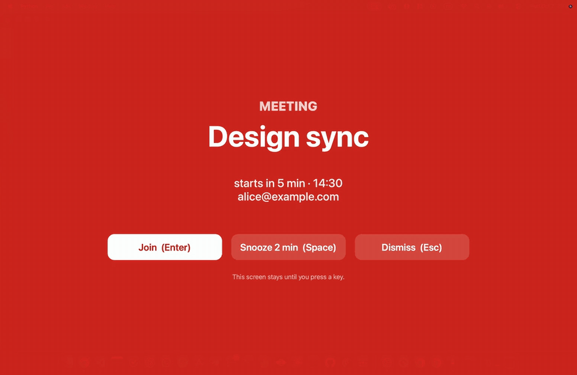

# meeting-alarm

[](https://github.com/bilalsengul/meeting-alarm/actions/workflows/ci.yml)

A calendar alarm you cannot miss: a full-screen red alert that takes over every monitor when a Google Calendar meeting is about to start.



## What it does

- Full-screen alert above everything, including fullscreen apps, on every monitor.
- Heads-up at T-5 minutes and a guaranteed alarm at T-0.
- Enter opens the join link, Space snoozes, Esc dismisses.
- Snoozing never goes past the meeting start.
- If you do not acknowledge the alarm after the start, it nags every 2 minutes for 15 minutes.
- Works on macOS (native Swift overlay) and Windows (tkinter overlay).
- Python standard library only, read-only calendar scope, no telemetry.

## Requirements

- Python 3.11+
- macOS 12+ with Xcode Command Line Tools (the Swift overlay is compiled on first run), or
- Windows 10/11 with Python from python.org (includes tkinter)

## Setup

1. Create your own Google OAuth desktop client. In the Google Cloud Console: create a new project, enable "Google Calendar API", configure the OAuth consent screen (External, add yourself as a test user), then Credentials -> Create OAuth client ID -> Desktop app -> Download JSON.
2. Grant access once (opens your browser):
   ```
   python3 auth.py --client-secret ~/Downloads/client_secret_xxx.json
   ```
   Optional flags: `--email HINT` (login hint), `--port 8898`, `--timeout 600`.
3. Try the overlay (no credentials needed): `python3 alarm.py --test`
4. List the upcoming alerts: `python3 alarm.py --next`
5. Install as a background service:
   - macOS: `./install.sh`
   - Windows: `.\install.ps1`

On Windows use `python` or `py -3` in place of `python3`.

## Configuration

Data directory: `~/.meeting-alarm` (override with the `MEETING_ALARM_HOME` environment variable). It holds `client_secret.json`, `credentials.json`, `config.json`, `state.json` and `alarm.log`. Copy `config.example.json` to `config.json` in that directory to customize.

| Key | Default | Meaning |
| --- | --- | --- |
| `lead_minutes` | `[5, 0]` | Minutes before start to alert. `0` is always enforced. |
| `poll_seconds` | `30` | Calendar polling interval. |
| `snooze_minutes` | `2` | Snooze length (never past the start). |
| `repeat_after_start_minutes` | `2` | Nag interval after start if unacknowledged. |
| `repeat_until_minutes_after` | `15` | Stop nagging this long after start. |
| `skip_declined` | `true` | Ignore events you declined. |
| `only_events_with_link_or_guests` | `false` | Ignore solo events without a join link. |
| `calendars` | `"selected"` | `"selected"` (ticked in the Google Calendar UI) or a list of calendar ids. |
| `language` | `"en"` | `"en"` or `"tr"`. |

```json
{
  "lead_minutes": [10, 5, 0],
  "snooze_minutes": 3,
  "calendars": ["primary", "team@example.com"],
  "language": "tr"
}
```

To switch language, set `"language": "tr"` (or `"en"`) in `config.json`; the daemon picks it up on restart.

## How the alarm logic behaves

- The start alarm always rings, even if you dismissed or snoozed the heads-up.
- Dismissing or joining at the start moment silences it.
- An unacknowledged alarm repeats every 2 minutes for 15 minutes.

## Uninstall

- macOS: `./uninstall.sh` (add `--purge` to also remove the data directory)
- Windows: `.\uninstall.ps1` (add `-Purge` to also remove the data directory)

## Privacy

Only the `calendar.readonly` scope is requested. The refresh token is stored locally in the data directory (mode 0600 on macOS). Nothing leaves your machine except calls to the Google APIs. There is no telemetry.

## Troubleshooting

- `403 SERVICE_DISABLED`: enable the Google Calendar API in the Cloud project that owns your OAuth client.
- "no credentials": run `auth.py` first.
- Overlay does not compile on macOS: run `xcode-select --install`.
- Windows, `No module named tkinter`: reinstall Python from python.org with the "tcl/tk and IDLE" option.
- Check `alarm.log` in the data directory for details.

## License

MIT
